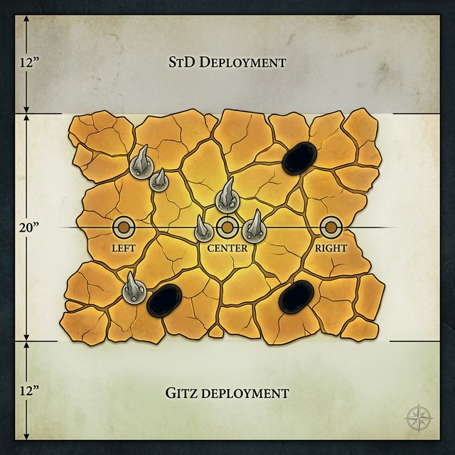

# Battle 7 — The Accounting

**Campaign:** The Wake of the World-Eater | Arc 2 — The Shattered Firmament
**Status:** Upcoming
**Armies:** Gloomspite Gitz (1150 pts) vs Slaves to Darkness (940 pts)
**Underdog:** Slaves to Darkness

---

## Narrative Hook

Bossy found the Bile Flats by accident, or the frequency found them. Three days after the Veldt, the signal had been pulling consistently northwest — not frantic, just insistent, like a compass needle under a magnet. He stopped arguing with it somewhere around midday.

The pitch has changed. That's the thing nobody else would notice, and Bossy isn't sure he can explain it. After the Chaos Lord went down on the Veldt, the sound inside his left ear moved — lower, slower, more deliberate. Less screaming. More like something very large paying attention. The God-Batch residue is still on his hands, dried to a faint amber crust along his knuckles. He's stopped trying to wash it off. He suspects, in the way grots suspect things without admitting them, that it has something to do with why the frequency changed.

The Bile Flats are what happens when something the size of a god bleeds into the earth and the earth has nowhere to put it. World-Eater bile has crystallised into amber plates across a hundred yards of dried lakebed, bone-spurs jutting up through the crust where the pressure built too high, the whole stretch creaking underfoot like old timber. The signal is strongest here. Bossy doesn't know what that means. He has one working theory: *walk toward it.*

The warband hadn't collapsed; it had contracted around something new. **Malakor the Unyielding**, an Anvil-forged leader who didn't rise to lead because he was powerful, but because someone had to carry the weight. Malakor's first test is the Bile Flats. No magic. No theatrics. Just the stillness of someone who has been told exactly what they're walking into.

The Chaos Sorcerer Lord stands somewhere at the back — still breathing, technically, though the Veldt left him spent and hollowed. The Chaos Chosen stand at Malakor's shoulder — six battles, a scar they'd never admit bothers them, and still unbroken. They've seen Bossy kill two of their lords. They have conclusions.

The warband's theology says suffering earns something. Bossy killed their Lord. The Sorcerer was destroyed by the drain. The Chosen wear the scar every campaign now costs them. What the martyrdom accumulates toward — that's what Malakor embodies.

Neither side is here to end the world. Both sides are here because something points here, and the only way to stop pointing is to find out what's at the end.

---

## The Location

**The Ossuary Run — Bile Flats.** A hundred yards of crystallised World-Eater bile, amber and bile-yellow, cracked into irregular plates that shift and creak underfoot. Bone-spurs of calcified organ matter jut up at irregular angles — two to four feet tall — forming natural broken cover across mid-field. The air smells of copper and old salt. In the cracks between plates, a thin black residue seeps: not dangerous, but warm to the touch. Bossy notices that touching it makes the frequency louder in his left ear.

*What makes it distinct from every previous location:* No water, no glass, no fire, no fungus. This is a dried-blood geography — hard, cracked, and biologically alien. The amber plates catch the Bad Moon's light and refract it sideways, making depth perception unreliable.

---

## Board Layout

- **Table size:** 44" × 60". Long-edge deployment.
- **Gitz deploy:** Within 12" of the south long edge.
- **StD deploy:** Within 12" of the north long edge.
- **No-man's-land (center 20"):** Difficult Terrain throughout for cavalry and monsters — the amber plates shift underfoot.
- **3 Objectives:** Placed in a straight east-west line through the center of the board, 20" apart. The central objective sits inside the densest bone-spur cluster.
- **Bone-Spurs (terrain):** Place 5–7 bone-spur formations across no-man's land. Each is a 2" base, Obscuring (blocks LOS through, not into). Cluster 2–3 around the center objective; spread the rest asymmetrically.
- **Acid Seep Markers:** Place 3 tokens anywhere in no-man's land, each at least 3" from any objective. Active hazards — see Special Rules.
- **Flanks:** Open hardpan. No walls, no high ground, no chokepoints. The only cover is the bone-spurs.

---

## Primary Objectives

Score **1VP** for each objective controlled at the end of each player's turn. A player controls an objective if they have more models within 3" of it than their opponent. Scoring begins end of Round 1.

The **central objective is worth 2VP** — the signal is strongest there. Both sides feel it.

---

## Asymmetric Secondaries

**Gitz — "The Frequency"**
At the end of any round where Grot Bossy finished his move within 6" of the StD General and both survived, score **2VP**. Not about killing — about proximity. The compass needle settling. Scores once per round, maximum 3 times total (6VP maximum).

**StD — "The Martyrs' Toll"**
Score **1VP** each time a friendly unit is destroyed within 6" of the new StD General. Suffering in the general's presence earns something in the martyrdom theology. No cap — scores every time.

---

## Special Rules

### 1. The Frequency (Environmental)

At the start of each round, before Priority is determined, the Gitz player rolls D6 for Grot Bossy alone. The frequency is not a gift — it is tinnitus with opinions.

| Roll | Effect |
|------|--------|
| 1 | The signal overwhelms. Subtract 1 from all his Run and Charge rolls this round *and* he may not use Titan's Whisper this round. |
| 2–3 | No effect. |
| 4–5 | Add 1 to all his Run and Charge rolls this round. |
| 6 | The dead god is paying attention. Add 1 to all his Run and Charge rolls *and* Titan's Whisper triggers automatically with no roll required this round (still gains 1 CP; does not risk Mortal Wound). |

This applies only to Bossy, not his unit or the wider warband.

### 2. Titan's Whisper (Grot Bossy — Character Ability)

Bossy carries the Titan's Whisper rank-up ability from Arc 2. At the start of each of his Hero Phases, he rolls D6:

| Roll | Effect |
|------|--------|
| 1 | Suffer 1 Mortal Wound — the frequency bites. |
| 2+ | Gain 1 Command Point. |

This interacts with The Frequency (above). On a Frequency roll of 6, skip this roll — the CP is generated automatically.

### 3. Acid Seeps

Any unit that ends a Move, Run, or Charge within 1" of an Acid Seep Marker suffers **D3 Mortal Damage** on a 2+. Seep Markers are permanent — they do not move or deactivate.

*Bossy exception:* Touching a Seep Marker costs Bossy nothing mechanically. He stands in the black residue and it makes the frequency louder. This has no in-game effect — it is a note for the Aftermath Gem.

### 4. The Drained Sorcerer

If the Chaos Sorcerer Lord is fielded, he remains DRAINED at the start of Battle 7. He cannot cast, unbind, or use abilities until the StD player rolls **4+** at the start of their Hero Phase. Once passed, the DRAINED status ends and he functions normally for the rest of the battle. One attempt per round only.

*Narrative texture:* If the Sorcerer recovers his casting mid-battle, the first spell he successfully casts this battle heals 1 wound (Ritual Scarring ability activates). The Sorcerer's Fear of Silence scar (Serious — subtract 1 from Casting rolls) remains active and stacks with the DRAINED recovery check.

---

## Character Growth Moments

**Loonsmasha Fanatics — Momentum Crash, first live use**
If the Fanatics trigger Momentum Crash against a unit of 5+ models and succeed, note whether they survived the round after. If yes — they are learning to time their own destruction. If no — they hit perfectly and it cost them. That is their nature crystallised. Flag both outcomes for the Aftermath Gem.

**Loonboss on Squig — Returning Veteran**
The Loonboss on Squig enters B7 fully healed — Cracked Ribs cleared, Commands restored. He can issue Commands normally. If he is destroyed this battle, the wound total and cause of death go to the Aftermath Gem. A proud veteran who healed and came back only to be broken the same way tells a closed story. A proud veteran who healed and *doesn't* repeat the pattern tells a different one. Either way, flag it.

**Chaos Chosen and the new General — the trust gap**
If the new StD General issues a Command to the Chaos Chosen during the battle, note whether the command produced its intended result or led to the Chosen being destroyed following the order. This is the first data point in what may be a long assessment. Flag for the Aftermath Gem.

*Secondary note — the Renown threshold:* The Chaos Chosen enter B7 at 28 Renown. Two more earns them Mighty rank. If they survive B7 and cross that threshold in the Aftermath, their rank-up happens in the shadow of a new general they may not yet respect. The Aftermath Gem should ask the StD player: does the Mighty milestone feel earned, or hollow?

**Boingrot Bounderz — the Adrenaline Junkies in open terrain**
B7's open flanks and hardpan edges are exactly where the Bounderz thrive — no obstacles, nothing to break the run. If they successfully Run and Charge in the same turn against a unit they do not destroy, note the outcome. The Adrenaline Junkies path is about *movement*, not kills. A charge that fails to break the target but commits them to a dangerous position is still on-flavour. Flag for the Aftermath Gem.

**Grot Bossy — the frequency and the dead god**
If Bossy rolls a 6 on the Frequency table in any round, the Aftermath Gem should note this moment and ask: *does Bossy know something changed, or does he just know his legs worked better this round?* The God-Batch residue on his hands and the lower pitch of the signal are texture — they are not answered this battle. But they are looked at.

---

## Twist Table (StD — Underdog)

Roll D6 at the start of any round in which StD is the underdog.

| Roll | Name | Effect |
|------|------|--------|
| 1 | Blood Debt | All StD units currently in combat may reroll one failed Wound roll this round. |
| 2 | Iron Patience | All StD units add +1 to Save rolls until end of this round. |
| 3 | The General's Voice | The new StD General may issue one Command this round at no CP cost. |
| 4 | Chosen's Momentum | The Chaos Chosen make a free 3" move that does not count as a Charge, even if already in combat. |
| 5 | The Bile Cracks | Place one additional Acid Seep Marker anywhere in no-man's land not within 3" of any unit. |
| 6 | Martyrs' Will | Pick one destroyed StD unit from this battle. Return it within 6" of any table edge with D3+1 models. It is not rallied — it simply refuses to be finished. |

---

## Battle Summary Row (Pre-filled for battle-summary.md)

| Battle | Core Mechanic | Secondary Type | Board Shape |
|--------|--------------|---------------|-------------|
| B7 | Central 2VP obj + 2 flanking 1VP objs | Asymmetric faction motivation (stalking vs suffering) | Bile Flats — amber plates, bone-spurs, acid seeps; long-edge deployment, open flanks |

---

## Victory Epilogue Seeds

*Not mechanically active — these exist for the Aftermath Gem to use. Whichever outcome occurs, pick the appropriate seed.*

**If the Gitz win:** The frequency pulls Bossy across the amber toward the center objective — and something under the plates answers. Not loud. Not words. A shift in pressure, like an eardrum adjusting to altitude. The God-Batch residue on his knuckles has left a faint amber smear on one of the bone-spurs. He doesn't remember touching it. Whatever is in the ground under the Bile Flats, it has now noticed him specifically. Seed for B8: *the location is significant; Bossy may be the reason.*

**If the StD win:** The new General holds the center and doesn't move. He lets the Gitz come to him and makes them stop. Whatever the martyrdom theology has been building toward, this battle is the first time the warband does something *with* it instead of just enduring. Seed for B8: *the new General's first tactical success defines what kind of commander he becomes — was it discipline, or was it luck?*

**Regardless of outcome:** The Chaos Chosen survive or they don't. If they do — 28 Renown entering the Aftermath. If they don't — what does it mean that the unbroken unit finally broke on B7, the very battle the new General took command? The Aftermath Gem should sit with this regardless of the battle result.

---

## Battle Map

---

## Pre-Battle Checklist

- [ ] **New StD General:** Malakor the Unyielding (Anvil Hero, 350 pts).
- [ ] **Active Quests:**
  - **Gitz:** Harness Manifestation (Taming the World-Eater's Frequency).
  - **StD:** Rise of a Champion (Malakor's First Battle).
- [ ] Confirm Chaos Chosen renown total — at 28, they are 2 from Mighty rank-up.
- [x] Confirm Gitz player is aware Boingrot Bounderz (Adrenaline Junkies) can now Run and Charge same turn.
- [x] Confirm Loonboss on Squig is cleared — Cracked Ribs healed to 0 wounds, he can issue Commands normally in B7.
- [ ] Remind StD player: Chaos Sorcerer begins DRAINED — must roll 4+ each Hero Phase to recover.
- [ ] Set aside 3 tokens for Acid Seep Markers before deploying.
- [ ] **RETCON — Chaos Chosen Shield Wall (B2):** Resolved.
