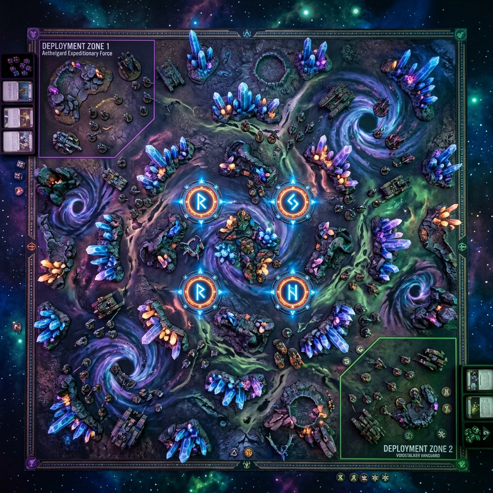

# Battle 8 — The Epicenter's Approach

**Campaign:** The Wake of the World-Eater | Arc 2 — The Shattered Firmament
**Status:** Upcoming
**Armies:** Gloomspite Gitz vs Slaves to Darkness
**Underdog:** Slaves to Darkness

---

## Narrative Hook

## Narrative Hook

For Bossy, the "why" is no longer about loot. It's about his sanity. 
The World-Eater's frequency has grown from a painful whisper into a physical, deafening pressure inside his skull. Ever since the Bile Flats, he knows *what* it is: the dying intelligence of the cosmic god has anchored itself in the deepest, most radioactive core of the crash site—the Epicenter. Bossy isn't just following the noise anymore; he is marching to the Epicenter to **consume the god's final spark** and force the screaming in his head to stop forever. Knowing Malakor's unbreakable iron wall waits for him, Bossy has summoned the fast-moving Snarlfang wolves to outmaneuver the Chaos line to reach the core.

For the Slaves to Darkness, the Epicenter is their crucible. 
They haven't just retreated defensively to the Crystalline Nexus to hide; Malakor (the Anvil) has brought them here for a specific reason. Malakor knows Bossy is coming for the core, but Malakor wants it for himself. To Malakor, crushing or dominating the dying will of a cosmic entity is the ultimate display of absolute supremacy. Taking the Epicenter's power will prove to the entire warband—and to the watching Chaos Lord—that Malakor is the true master of the Slaves to Darkness. 

Both armies are converging on the Epicenter's Approach because **they both need to claim the core of the dead god for themselves.** Bossy needs it for his sanity; Malakor needs it to cement his terrifying reign. The collision is inevitable.

---

## The Location

**The Inner Impact Ridge — The Epicenter's Approach.** The ground here is permanently skewed, crystalline splinters of reality jutting out from where the World-Eater cracked the realm. The gravity occasionally shifts, pulling upward before slamming back down. Arcane discharge arcs unpredictably from crystal outcroppings. 

*What makes it distinct from every previous location:* Verticality and anomaly. The battlefield is littered with Crystalline Pillars (Impassable), and the air shimmers with energy that disrupts heavy and slow movements but leaves the fast and furious free to maneuver. 

---

## Board Layout

- **Table size:** 44" × 60". Corner-to-Corner deployment (Diagonal).
- **Gitz deploy:** Within 12" of their chosen corner.
- **StD deploy:** Within 12" of the opposite corner.
- **No-man's-land:** Features dense clusters of Crystalline Pillars breaking up the center.
- **3 Objectives:** One placed in the absolute center. The other two placed 15" away from the center objective along the remaining diagonal axis, encouraging wide flanks.

---

## The Twist: Dual Tables — The Gravity Well vs The Bad Moon
*The ground of the Epicenter is dangerously volatile, reacting wildly to whoever is losing ground.*

**1. Determine the Underdog:**
At the start of **each** Battle Round, determine the current Underdog.
*   **Round 1:** The Underdog is the Slaves to Darkness (*Campaign Underdog*).
*   **Rounds 2-5:** The Underdog is the player with the *fewest Victory Points* in this match. 
*   **The Double-Turn Clause:** If a player takes a "back-to-back" turn (winning priority and going first), their opponent **automatically** becomes the Underdog for that round, regardless of VP score.

**2. Roll the Twist:**
The Underdog rolls a D6 on their respective Twist Table below. The effect lasts until the end of the battle round.

**Slaves to Darkness Twist Table (The Gravity Well)**
*Malakor weaponizes the heavy, crushing weight of the dead god's core.*
*   **1-2 (Minor):** The friendly StD unit closest to the center objective gains +1 to their Save rolls this round.
*   **3-4 (Moderate):** Pick an enemy unit within 12" of the center objective. Halve their Move characteristic; they cannot run this round.
*   **5-6 (Major - The Collapsing Core):** Pick one of the 4 objectives on the battlefield. It detonates, dealing D3 mortal wounds to all units within 3" of it. It is then **removed from the board entirely** and can no longer be controlled or scored.

**Gloomspite Gitz Twist Table (The Bad Moon's Pull)**
*Bossy uses hallucinogenic magic to override the gravity and propel his forces forward.*
*   **1-2 (Minor):** Pick a friendly Squig or Snarlfang unit. They ignore all movement penalties from terrain this turn.
*   **3-4 (Moderate):** A spore-cloud obscures the pack. Pick one objective; friendly units contesting it are -1 to be hit by ranged attacks this round.
*   **5-6 (Major - Loony Teleport):** Pick a friendly Gitz unit that is not a Monster. Remove it from the board and set it up anywhere on the battlefield more than 9" from all enemy units.

---

## Primary Scoring: The Overloading Cores

*There are **4 Objectives** placed evenly across the board (diamond pattern, one touching each deployment zone, two in the middle).*

Each player scores victory points at the end of each of their turns as follows (Maximum of 10 VP per turn):
*   Score **5 VP** if you control at least 1 objective.
*   Score **3 VP** if you control 2 or more objectives.
*   Score **2 VP** if you control more objectives than your opponent.

*(Note: If the Slaves to Darkness roll a 5-6 on their Twist Table, objectives may be destroyed, heavily concentrating the fighting in later rounds).*

---

## Asymmetric Secondaries

**Gitz — "The Pack's Perimeter"**
To represent Bossy's new wolf tactics, the Gitz gain an advantage in maneuverability.
Score **2VP** at the end of any round if you control either of the outer/flank objectives and there are NO Slaves to Darkness units within 9" of it. This rewards isolating elements of the Chaos line through speed. Scores once per round, maximum 3 times total (6VP maximum).

**StD — "The Silent Wall"**
The Chaos Chosen are a rock breaking the tide. If a friendly Slaves to Darkness unit is wholly within 6" of the central objective at the end of the round, they score **1VP**. If that unit is the Chaos Chosen, score **2VP** instead.

---

## Special Rules

### 1. The Wolf-Pack Flank (Gitz Mechanics)
All Snarlfang units (Snarlboss on War Chariot, Snarlboss, Wolfgit Retinue, Snarlfang Riders) may make a pre-game move of 6" after deployment but before the first battle round begins. 

### 2. The Unshakeable Elite (StD Mechanics)
The Chaos Chosen are locked in their Vow of Silence and singular purpose. **They ignore the first negative modifier applied to them (of any kind: hit, wound, save, rend) each phase.** Their minds are completely closed to anything but the slaughter in front of them.

### 3. The Unpredictable Liability (Environmental/Mutalith Mechanics)
The Mutalith Vortex Beast is reacting terribly to the Epicenter. At the start of the StD Hero Phase, the StD player must spend **1 Command Point** to keep it leashed. If they choose not to or cannot, roll a D6. On a 1-3, the Mutalith immediately suffers D3 Mortal Wounds and its Move characteristic is halved for that turn. On a 4-6, it gains +1 to Hit and Wound rolls this turn, driven into a frenzy, but must automatically declare a charge against the nearest unit (friend or foe) if possible.

### 4. Epicenter Gravitational Anomalies
At the start of the combat phase, roll a D6. On a 1, a gravitational anomaly triggers. All charge rolls made this turn by non-Snarlfang and non-Cavalry units are reduced by 2.

---

## Character Growth Moments

**Snarlboss & Wolf units — The First Hunt**
If the Snarlfang Riders or Wolfgit Retinue steal an objective from StD control using their speed, note the outcome. Bossy has realized brute force failed against Malakor; he needs verification that speed works. Flag for the Aftermath Gem.

**Chaos Chosen — 1 Renown to Mighty**
The Chosen enter B8 sitting on 29 Renown, needing exactly 1 to reach Mighty rank. They have taken the Vow of Silence to atone for their humiliation against the Chariot. If they manage to destroy the Snarlboss on War Chariot in this battle, they break their vow with a triumphant roar and immediately cross the threshold to Mighty (with narrative flourish). Flag for the Aftermath Gem.

**Malakor vs Chaos Lord — Tense Command**
The tension between them grows. Record which hero issues the most Command Abilities this battle. The one leading the warband practically vs. officially will determine the narrative shift in the overarching structure.

---

## Legacy Tracking

*(Note: The old single generic Underdog ability has been retired for this and future battles in favor of the new faction-specific **Dual Twist Tables** and the anti-double-turn Underdog clause.)*

---

## Battle Map

---

## Pre-Battle Checklist

- [x] Confirm the inclusion of Snarlboss, Wolfgit Retinue, and Snarlfang Riders into the Gitz roster.
- [x] Verify Chaos Chosen are tracking their vows of silence and are 1 Renown away from Mighty.
- [x] Remind StD player of the CP tax for the Mutalith Vortex Beast each round.
- [x] Determine final deployment zones in Corner-to-Corner format.
